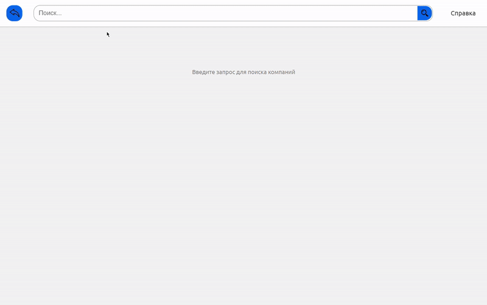

# 🧠 Клиентская платформа анализа настроений

**Фронтенд-часть веб-платформы анализа отзывов о компаниях на основе языковой модели.**  
Проект был разработан в рамках стартапа и позволяет демонстрировать ключевой функционал работы с пользовательскими отзывами.

---

## 📌 Описание

Данный сервис предоставляет аналитический обзор заданной компании, включая:

- Поиск информации о деятельности компании в интернете
- Сбор отзывов с разных источников
- Автоматическую генерацию краткого обзора с помощью языковой модели
- Указание источников, из которых была получена информация

---

## 📸 Демонстрация

> 

---

## 🛠️ Технологии

- **Верстка:** React.js + Vite  
- **Сервер:** Nginx  
- **Деплой:** Docker  

> ⚠️ В этом репозитории содержится **только фронтенд**.  
> Все запросы к серверу заменены на **mock-файлы**.  
> Любые конфиденциальные или частные данные были удалены.

---

## 🚀 Быстрый старт (демо-режим)

Для локального запуска демоверсии интерфейса:

1. Откройте консоль в папке с проектом  
   (где расположен `readme.md`, `index.html`, и т.д.)

2. Установите зависимости:
   ```bash
   npm install
   ```

3. Запустите проект:
   ```bash
   npm run dev
   ```

4. В консоли появится ссылка вида:  
   ```
   http://localhost:5173
   ```

5. Введите название компании в поисковую строку.

> 🔎 В mock-базе для демонстрации используется **РЖД**  
> На её примере вы сможете увидеть основные функции веб-интерфейса.

---

## 🧪 Примечания

- Все данные в этом репозитории являются **тестовыми** и используются исключительно для **демонстрации UI**.
- Backend и связанная с ним логика находятся в закрытом хранилище и не распространяются.

---

## 🧑‍💻 Авторы

Разработано в рамках команды стартапа.  
Для связи и сотрудничества

### Лобанов Иван

Место проживания: Свердловская область, Екатеринбург

Возраст: 19

Контакты:

Телефон: +7 982 652 81 17

Telegramm: @Yackunia

Почта: lobanovivan116@gmail.com

Github: yackunia

---
